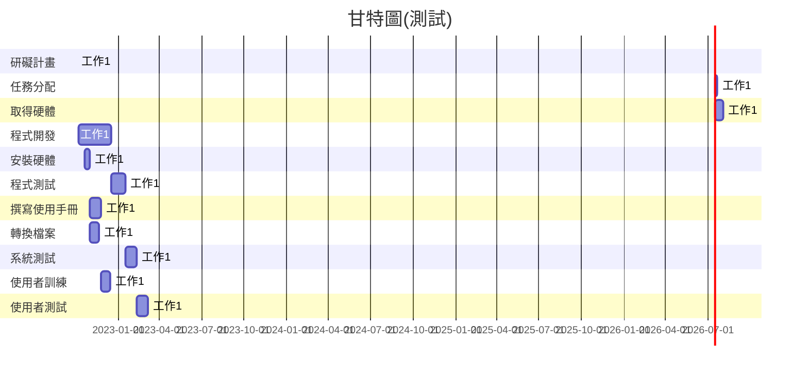

|  任務  |  說明    | 需時<br>(天) | 前置<br>任務  |
| :--:   |:----    | :-----:  | :-----:  |
| 1      | 研礙計畫 |  1       | -        |
| 2      | 任務分配 |  4       | 1        |
| 3      | 取得硬體 | 17       | 1        |
| 4      | 程式開發 | 70       | 2        |
| 5      | 安裝硬體 | 10       | 3        |
| 6      | 程式測試 | 30       | 4        |
| 7      | 撰寫使用手冊| 25    | 5        |
| 8      | 轉換檔案 | 20       | 5        |
| 9      | 系統測試 | 25       | 6        |
| 10     | 使用者訓練 | 20     | 7、8     | 
| 11     | 使用者測試 | 25     | 9、10    |


```
digraph {
	node[shape=record];
	rankdir="LR";
    no1 [label = "取得授權 | 編號:1 | 開始:第1天 | 結束:第10天 | 需時:10天"]
    
    no2 [label = "聘僱分析師 | 編號:2 | 開始:第11天 | 結束:40 | 需時:30天"]
    no3 [label = "規劃訓練 | 編號:3 | 開始:第41天 | 結束:第45天 | 需時:5天"]
    
    no1->no2
    no1->no3
    {rank=same;no2 no3}
    
    no4 [label = "安排後勤 | 編號:4 | 開始:第41天 | 結束:第65天 | 需時:25天"]
    no2->4
    
    no5 [label = "宣告訓練 | 編號:5 | 開始:第66天 | 結束:第95天 | 需時:30天"]
    no3->no5
    {rank=same;no4 no5}
    
    
    no4->no5
}
```
